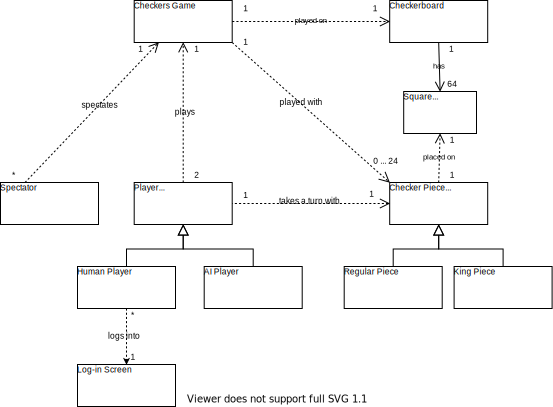
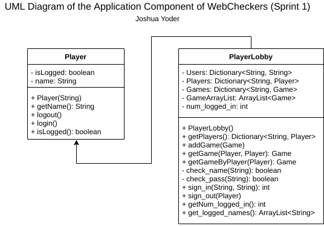
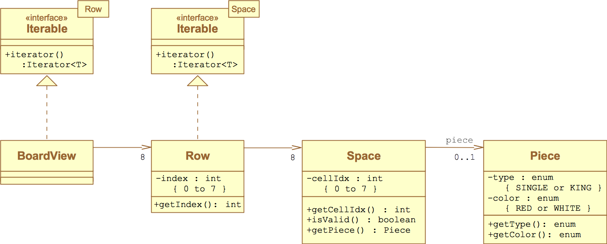

# WebCheckers Design Documentation

## Team Information

- Team name: VibeCheckers
- Team members
  - Jonathan Baxley
  - Dhaval Shrishrimal
  - Joshua Yoder
  - Joe Netti
  - Andre Decosta

## Executive Summary
This project is WebCheckers, it will provide an online tool for people to play
checkers with their friends, provide statistics, play against AI, and spectate
games.

### Purpose
The goal of this project is to learn more about java spark web framework. The
user group is anyone who wants to play checkers online. Our goal for users is
that they have a positive experience playing WebCheckers online either against
a real person or our AI.

### Glossary and Acronyms

| Term | Definition     |
|------|----------------|
| UI   | User Interface |

## Requirements
This section describes the features of the application.

>- *Sign-in*: Feature allows users to sign-in and create accounts from with to
  play checkers on. Also allows users to sign-out.
>- *Game Creation*: Allows signed-in users to create a game with other
  signed-in users. Doesn't allow users to play with players in other games.
>- *Play Checkers*: Checkers needs to be playable according to American
  Checkers Rules. This includes a couple epics including move making,
  resignation, and win conditions.
>- *AI Gameplay*: Player must be able to play against an AI.
>- *Spectator*: User must be able to spectate other users games.

### Definition of MVP
The minimum viable product is a website that has a functioning sign-in page, a
home page that allows user to pick who to play against, a working checkers game
that properly follows American Checkers rules, allows players to quit, has a
proper win condition. In addition to this minimum viable product, it must also
have enhancements of spectating games and playing against an AI of varying levels
of difficulty.

### MVP Features

>- Sign-In
>- Game Creation
>- Game Resignation
>- Move Making
>- King Crowning
>- King Movement
>- Win Condition

### Roadmap of Enhancements

>- Play against AI
>- AI difficulty selection
>- Spectate game

## Application Domain
This section describes the application domain.

>- A *checker piece* can either be a regular piece or a king piece, and has a color
  attribute. A single checker piece lies on a *square*.
>- A *player* can either be a human or an AI player, and has a color attribute.
  Human players can log into the application via the *Log-In Screen*. A single player
  takes a turn with a single checker piece. Two players play a single checkers game.
>- Many *spectators* can spectate a given checkers game.
>- A *checkers game* is played on a single *checkerboard*, with 0 to 24 *checker pieces*.
>- A *checkerboard* has 64 *squares*.
>- A *square* has location and color attributes.

## Architecture and Design
This section describes the application architecture.

### Summary
The following Tiers/Layers model shows a high-level view of the webapp's
architecture.

>_As a web application, the user interacts with the system using a
browser.  The client-side of the UI is composed of HTML pages with
some minimal CSS for styling the page.  There is also some JavaScript
that has been provided to the team by the architect._

>_The server-side tiers include the UI Tier that is composed of UI Controllers
and Views. Controllers are built using the Spark framework and View are built
using the FreeMarker framework. The Application and Model tiers are built
using plain-old Java objects (POJOs)._

Details of the components within these tiers are supplied below.

### Overview of User Interface
This section describes the web interface flow; this is how the user views and
interacts with the WebCheckers application.

### UI Tier
> _Provide a summary of the Server-side UI tier of your architecture.
> Describe the types of components in the tier and describe their
> responsibilities.  This should be a narrative description, i.e. it has
> a flow or "story line" that the reader can follow._

> _At appropriate places as part of this narrative provide one or more
> static models (UML class structure or object diagrams) with some
> details such as critical attributes and methods._

> _You must also provide any dynamic models, such as statechart and
> sequence diagrams, as is relevant to a particular aspect of the design
> that you are describing.  For example, in WebCheckers you might create
> a sequence diagram of the `POST /validateMove` HTTP request processing
> or you might show a statechart diagram if the Game component uses a
> state machine to manage the game._

> _If a dynamic model, such as a statechart describes a feature that is
> not mostly in this tier and cuts across multiple tiers, you can
> consider placing the narrative description of that feature in a
> separate section for describing significant features. Place this after
> you describe the design of the three tiers._

### Application Tier

>_All Players that have an account are stored in the PlayerLobby. All games of players in the lobby are stored in the PlayerLobby, but in future releases a GameCenter will be taken over this functionality._

>_The Player and PlayerLobby classes has the following structure:_

>_The PlayerLobby class sign's players in and out, checks username's and passwords of players, and stores games of players._

### Model Tier

>_The above UML contains classes that are in the model. The classes in model specify the structure of the components of a checkers game--from pieces, to board, to game. Specifically: each game has a board, each board has 8 rows of spaces, each space may have a piece, and pieces have a type and color. This very *clean* design provided by the beloved product owner has minimal coupling and high cohesion. Board "talks" to Row, Row "talks" to Space, Space "talks" to Piece. We added a game class to store the board of a game and players of the game. Game is the high-level class that is called to make moves in a game._

### Design Improvements
> _We would like to make our project adhere to the object oriented principles more strictly than they currently. We plan on making improvements to liskov substitution, polymorphism, cohesion, coupling, and other principles. There are also other places the project code could with more work, run more efficiently and crisper. One place that these improvements are being made is with piece and gamecenter. Piece is being rewritten to an abstract Class with subclasses of king and single. GameCenter is being created to handle multiple games at a time to help with the implementation of spectating._

## Testing
> _The testing for individual acceptance criteria and the completion of user stories went as followed. First, a blanket test of the acceptance criteria to fit the minimum requirements of what was stated. This test would check to see if it can handle the bare minimum without crashing. Then, we would check the bare minimum for bugs that don't crash the program but give incorrect information. Finally, if the user story had held up so far, we would test all fringe cases and do everything in our power to try to break the program/make it crash. If it passes all of these tests then the user story or epic would meet the definition of done. An example of this was in testing password functionality. First, it would go to sign in and putting in a password, then it should reroute to home. It passed this at minimum. Next, we checked for bugs, and saw there were none. Finally, we checked all fringe cases. Some examples of these fringe cases were, what happens if we reload the page, what happens if no password is put in, what happens if no username is in, what happens if the username already exists, et cetera. We did this process for all user stories in sprint 1 and some of sprint 2 so far. All passed with no issues._

### Acceptance Testing
>_So far 16 user stories have passed all acceptance criteria._
>_So far 0 user stories have failed any acceptance criteria._
>_The remainder of user stories for sprint 2 and sprint 3 have not yet had any testing._

### Unit Testing and Code Coverage
>_Our unit testing strategy was to identify everything single method for the class that was _
>used and to make a test for each method. The goal of this was to ensure that all code
> was tested and have 100 percent code coverage. Our webcheckers UI has 68 percent
> code covered at this time. This is much lower because only the bare minimum tests
> have been made. Currently there are no tests for Webserver or PostsignoutRoute
> which significantly lowers our code coverage for UI. We plan on implementing tests
> for these in sprint 2 or sprint 3. Our webcheckers Model has 88% code coverage with
> only the piece function missing a test. This will be implemented later. Our
> webcheckers Application has 46 percent code coverage. PlayerLobby and GameCenter
> currently are not tested because they are still in progress for development but will be
> implemented later. Our goals for code coverage are at least 80 percent for each tier.
> We decided on 80 percent because some of our functions are difficult to test due to
> high coupling between the classes. Piece is an example of a difficult to test class
> because of its abstract nature. 80 percent is a good goal because while its not
>perfect it accounts for the majority of the code. As of now only our model meets this
>but we plan on fixing it to have three tiers meet the 80 percent threshold._